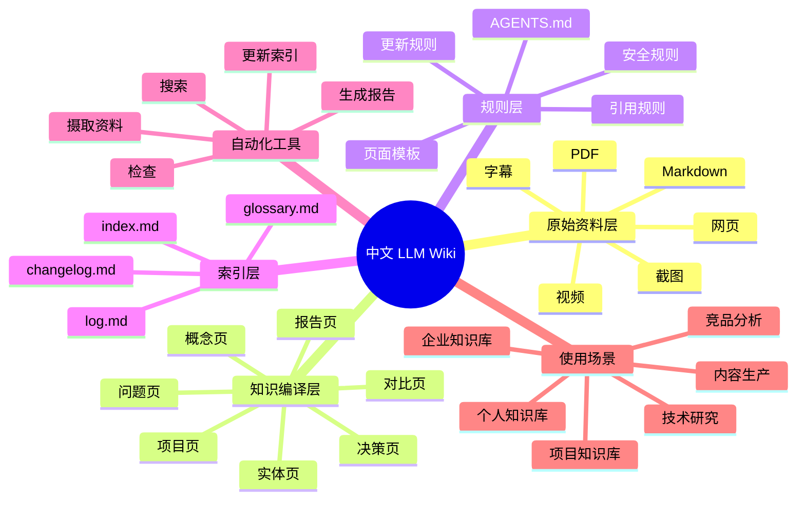

---
title: "Karpathy LLM Wiki 中文解读"
type: "report"
status: "active"
tags: ["报告", "Karpathy", "解读"]
created: "2026-05-29"
updated: "2026-05-29"
sources:
  - "https://gist.github.com/karpathy/442a6bf555914893e9891c11519de94f"
  - "https://www.youtube.com/watch?v=t4lnadkVy8E"
related:
  - "LLM Wiki"
  - "RAG"
  - "知识编译"
---

# Karpathy LLM Wiki 中文解读

## 一句话总结

Andrej Karpathy 提出的 LLM Wiki 是一种面向 AI Agent 维护的结构化知识编译系统，核心思想是"让 LLM 先消化资料、写成结构化 Wiki，而不是实时去搜"。

## 背景问题

Karpathy 在 2025 年初分享了他用 LLM 维护个人知识库的实验。他发现：
- 传统知识管理（书签、笔记、Notion）随着资料增多变得不可维护
- RAG（检索增强生成）虽然流行，但分块检索的方式在深度知识场景下效果不佳
- LLM 有能力"读懂"资料，但在 RAG 模式下只能被动检索碎片

## LLM Wiki 是什么

LLM Wiki 不是传统的 Wiki（人写的），也不是 RAG（机器搜的），而是一个中间态：
- AI Agent 阅读资料
- 理解、提炼、结构化
- 写成维基页面
- 人与人可读，LLM 也可直接理解

## 它不是普通 RAG

| | RAG | LLM Wiki |
|---|-----|----------|
| 知识形态 | 碎片（chunks） | 完整页面 |
| 理解深度 | 表面匹配 | 深层理解 |
| 维护 | 重新索引 | 增量编辑 |
| 幻觉风险 | 中高 | 低 |

LLM Wiki 不是用来"搜索答案的"，而是用来"沉淀知识的"。

## RAG 与 LLM Wiki 对比表

| 维度 | RAG | LLM Wiki |
|------|-----|----------|
| 核心理念 | 实时检索 + 增强生成 | 预先编译 + 结构化页面 |
| 知识处理 | 分块 → 向量化 → 检索 | 理解 → 提炼 → 编写 |
| 知识形态 | 文本片段 | 完整结构化页面 |
| 上下文完整性 | 容易断裂 | 页面内完整 |
| 维护者 | 自动索引 | AI Agent + 人类 |
| 可审计性 | 低 | 高（Git diff） |
| 虚构风险 | 中高 | 低 |
| 适用资料量 | 海量非结构化文档 | 需要深度理解的核心知识 |

## 核心架构

### raw 原始资料层
- 存放从各渠道收集的原始资料
- 网页文章、视频、PDF、Markdown、截图、字幕等
- **不修改原始资料**——保持完整的来源追溯能力

### wiki 知识编译层
- 概念页：核心概念的解释和关联
- 实体页：公司、产品、人物、工具
- 项目页：具体项目的知识沉淀
- 流程页：标准操作流程
- 问题页：常见问题及解答
- 对比页：方案、工具、概念的横向对比
- 报告页：综合分析、调研报告
- 决策页：重要决策的记录和依据

### index 索引层
- `index.md`：知识入口，按类型组织页面
- `log.md`：操作日志，按时间记录所有维护动作
- `changelog.md`：版本变更记录
- `glossary.md`：术语表

### log 时间线层
- 每次操作都有记录
- 可追溯：谁（Agent/人）在什么时候做了什么

### AGENTS 规则层
- 定义 AI Agent 的行为规则
- 明确页面格式、类型、状态、链接规则
- 确保 Agent 维护的知识库质量统一

### tools 自动化层
- `wiki_search.py`：本地搜索
- `wiki_lint.py`：健康检查
- `update_index.py`：自动更新索引
- `ingest_source.py`：资料摄取
- `extract_frontmatter.py`：元数据提取
- `generate_report.py`：报告生成

## 主要思维草图

## 关键洞察

1. **先编译，后检索**：LLM Wiki 把"理解"放在事前，而不是检索时临时拼凑。
2. **Agent 是编辑，不是搜索引擎**：AI 的角色是消化和编写，不是模糊搜索。
3. **结构化是 AI 友好的前提**：统一的格式让 AI 能批量维护。
4. **Git 是知识库的终极版本控制**：每次修改可审查、可回滚。
5. **人和 AI 分工**：AI 做重复性工作，人做判断和决策。